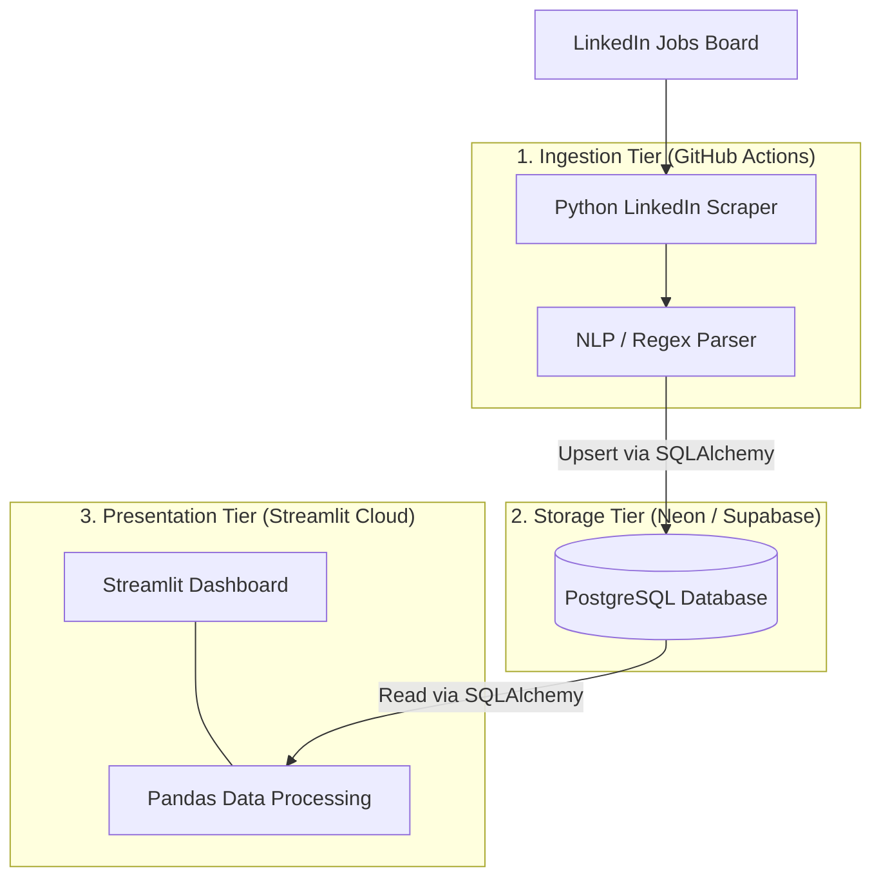

# System Design Document: RealityCheck

## 1. System Overview
**RealityCheck** is an automated data pipeline and visualization application designed to monitor the junior software engineering job market. It continuously ingests job postings, parses them for required experience and technology stacks, and presents the aggregated data on a live public dashboard.

## 2. High-Level Architecture

The system is composed of three entirely decoupled tiers, minimizing operational costs to zero while ensuring high reliability.

### 2.1 Ingestion Tier (Scraping Worker)
- **Environment**: GitHub Actions Ubuntu Runner
- **Trigger**: Cron schedule (daily at midnight UTC)
- **Role**: Launches a headless browser to navigate LinkedIn jobs, extracts raw HTML, parses out relevant metrics, and loads them into the database.

### 2.2 Storage Tier (Database)
- **Environment**: Serverless Cloud PostgreSQL (e.g., Neon.tech, Supabase)
- **Role**: Persistent data store holding historical job data. Uses a relational model to link jobs to extracted skills.

### 2.3 Presentation Tier (Frontend Dashboard)
- **Environment**: Streamlit Community Cloud
- **Role**: Public-facing web application. Queries the database on load, performs on-the-fly analytical transformations using Pandas, and renders interactive charts.

## 3. Data Flow
1. The scheduled GitHub Action triggers the Scraper.
2. The Scraper navigates LinkedIn, searching for "Junior Software Engineer", bypassing basic anti-bot measures, and saving raw job descriptions.
3. The internal Parser runs regular expressions and text matching to extract `years_of_experience`, `ai_tools_required`, and `tech_stack`.
4. The structured records are committed to the PostgreSQL database.
5. A user visits the Streamlit URL.
6. The Streamlit app reads from PostgreSQL, caches the data locally, and visualizes the market reality.

## 4. System Attributes
- **Cost**: $0/month.
- **Maintenance**: Extremely low. The primary failure point is LinkedIn altering its DOM structure, which would require updating the scraper's CSS selectors.
- **Scalability**: The database can store millions of rows. Streamlit handles moderate traffic gracefully, and Streamlit Cloud handles the scaling.
